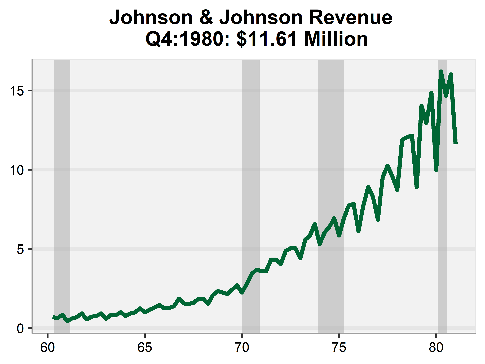

```{r, include = FALSE}
knitr::opts_chunk$set(
  collapse = TRUE,
  comment = "#>",
  warning = FALSE,
  message = FALSE
)
```

### Load Packages

```{r setup}
# CSM package
library(csm)

# Other packages
library(tidyverse)
library(lubridate)
library(Cairo)

first <- function(x) head(x, 1)
last <- function(x) tail(x, 1)
```


### Example: Plot

Suppose we have data that looks like this:
```{r}
time <- seq.Date(as.Date("1960-03-31"), as.Date("1980-12-31"), by = "quarter")
jj_revenue <- as.numeric(JohnsonJohnson)
df <- data.frame(time, jj_revenue)
head(df)
```

`theme_csm` imitates CSM's Excel aesthetics. \
`add_rec_shad` easily adds recession bars. \
`csm_green` pulls in CSM's official green shade.

You can use these procedures to automate charts that use data APIs compatible with R.

```{r, out.width="70%", out.height="70%"}
chart <- ggplot(data = df) +
  aes(x = time, y = jj_revenue) +
  add_rec_shade(first(df$time), last(df$time)) + 
  geom_line(color = csm_green(), size = 1.2) +
  scale_x_date(date_labels = "%y") +
  labs(title = paste0("Johnson & Johnson Revenue \n ",
                      "Q",
                      last(quarter(time)),
                      ":",
                      last(year(time)),
                      ": ",
                      "$",
                      last(jj_revenue), 
                      " Million")) +
  theme_csm()
ggsave("jnj_revenue.png", chart, dpi = 700, width = 4, height = 3)

```


### Example: Find The Best Model

Since the 10-Year Bond Model, we have referred to "best subset selection" as the "Best Model" method.

Given an  $n \times 1$ outcome $Y$ and $n \times k$ space of predictors $Z$, use exhaustive search to find the least-squares linear model $Y = X \hat \beta + \hat \varepsilon, X \subseteq Z$ that optimizes an information criterion: Bayesian or Akaike.

If $k \geq 15$ exhuastive search is infeasible, so we use step-wise search.

Suppose we have data that looks like this.
```{r}
df <- MASS::Boston
head(df)
```

Easily find the best combination of variables to predict `medv`.
```{r}
house_val <- df %>% select(medv)
predictors <- df %>% select(-medv)
reg <- best_model(house_val, predictors)
summary(reg)
```

